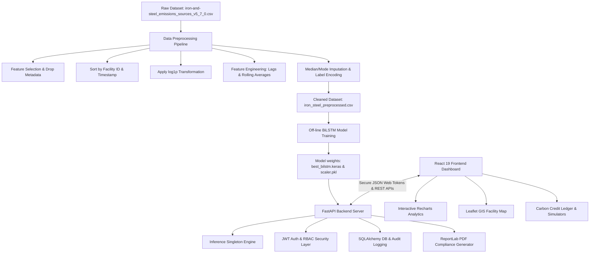

# 🌿 Smart Carbon Credit Analytics & Industrial Emission Forecasting Platform

An enterprise-grade, AI-powered software solution designed to forecast industrial greenhouse gas emissions, manage carbon offset credits, ensure compliance, and generate audit-ready reports. Built specifically around the carbon-intensive **Iron & Steel manufacturing sector**, the platform combines a state-of-the-art Deep Learning forecasting model with a robust, secure, and interactive dashboard.

---

## 📝 Abstract

As global regulatory frameworks tighten under international climate agreements, carbon-intensive industries—specifically the **Iron & Steel sector**—must transition from historical environmental reporting to predictive carbon management. This project presents a unified, enterprise-grade, full-stack **Smart Carbon Credit Analytics and Industrial Emission Forecasting Platform**. 

The core predictive intelligence leverages a **Bidirectional Long Short-Term Memory (BiLSTM)** neural network trained on facility-level longitudinal datasets to forecast greenhouse gas emissions based on activity rates, operational capacities, geographic location, and historical behaviors. The machine learning pipeline handles data cleaning, feature engineering (generating multi-step lags, rolling averages, and temporal variables), and applies a `log1p` transformation to normalize right-skewed target emissions.

The software architecture is split into a decoupled full-stack application:
1. **FastAPI Backend**: A high-performance Python ASGI backend serving JWT-authenticated REST APIs, implementing Role-Based Access Control (RBAC), managing SQLite persistence with SQLAlchemy and Alembic migrations, logging user actions for auditing, and executing real-time predictions via an AI inference singleton. It also automates the generation of compliant PDF reports using ReportLab.
2. **React 19 & Vite Frontend**: A modern, responsive dashboard styled with Tailwind CSS v4 and animated using Framer Motion. It incorporates Recharts for data visualization, Leaflet for GIS-based geographic mapping of emitting facilities, and form validation using React Hook Form and Zod.

The system automates the transition of predictions into verifiable carbon credits, offering an end-to-end framework for facility operators and compliance auditors to predict emissions, calculate offsets, manage portfolios, and generate authenticated compliance documentation.

---

## 🔍 Introduction

Greenhouse gas emissions from industrial operations are the primary drivers of climate change. Heavy manufacturing, and specifically the **Iron and Steel industry**, is responsible for approximately 7-9% of direct global carbon dioxide ($CO_2$) emissions. As carbon pricing mechanisms, emissions trading systems (ETS), and carbon border taxes (such as the EU's Carbon Border Adjustment Mechanism) become mandatory worldwide, industrial facilities must manage their carbon footprints with the same rigor as their financial balance sheets.

Traditional carbon accounting practices are retroactive, relying on annual reporting cycles that log emissions months after they have occurred. This makes it impossible for operators to make timely adjustments to their industrial processes.

This project introduces a **Smart Carbon Credit Analytics & Industrial Emission Forecasting Platform** designed to solve this limitation. The platform provides a dual-purpose environment:
1. **Predictive Analytics Engine**: Employs a Deep Learning BiLSTM model to forecast future emissions based on target operational features (capacity, utilization factor, activity rate, and location) along with facility-specific historical context (lags and rolling averages).
2. **Carbon Credit Registry**: Integrates these forecasts into a credit accounting ledger. When facilities optimize processes and lower their predicted emissions below standard baselines, the reduction is automatically calculated and recorded as carbon offset credits:
   $$\text{Carbon Credits Generated} = \max(0, \text{Baseline Emissions} - \text{Predicted Emissions})$$

By combining machine learning forecasting with a secure, role-based database registry, the platform enables operators to simulate operations, optimize carbon credit portfolios, and output verified compliance reports.

---

## 💡 Motivation

The development of this platform is motivated by the critical need for digital solutions in corporate sustainability and environmental regulatory compliance:

1.  **Transitioning from Reactive to Proactive Mitigation**:
    Instead of calculating emissions after they have entered the atmosphere, facility managers need tools that allow them to simulate operational changes. For example, modifying the capacity utilization factor or changing fuel types in the app can predict the immediate impact on emissions, allowing managers to actively prevent regulatory limit violations.
2.  **Financial Impact of Global Carbon Taxes**:
    Under systems like the EU Carbon Border Adjustment Mechanism (CBAM) and regional Cap-and-Trade programs, carbon has a direct financial price. High emissions lead to severe penalties, while lower emissions generate tradable carbon credits. Accurate forecasting allows companies to project compliance costs, hedge carbon credits, and optimize their production schedules to minimize tax liabilities.
3.  **Preventing Double-Counting and Greenwashing**:
    The voluntary carbon market has faced criticism due to a lack of verification, leading to double-counting and fraudulent credit creation. A system that mathematically links credit generation to concrete, AI-verified, facility-specific emission forecasts provides an auditable paper trail, increasing trust and transparency.
4.  **Automating Compliance and Reducing Administrative Overhead**:
    Industrial facilities must regularly submit compliance documents to regulatory agencies. Manually generating these reports is labor-intensive and prone to human error. Automating this via dynamic PDF generation—stamped with cryptographic tracking IDs, facility metadata, and calculated credit balances—saves operational overhead and ensures consistency.
5.  **Role-Based Security for Sensitive Corporate Data**:
    Industrial production rates and carbon capacities are highly sensitive proprietary data. A secure environment with Role-Based Access Control (RBAC) is essential. Standard operators should only submit predictions and view analytics, while compliance auditors and admins must oversee system configuration, review user audit logs, and monitor model performance indicators.

---

## ⚠️ Problem Statement

Despite the growing urgency for carbon neutrality, industrial facilities face several major technical hurdles:

1.  **Inability to Forecast Dynamic Time-Series Patterns**:
    Emissions are not static; they exhibit strong temporal patterns, cyclical variations (based on seasonal production schedules), and high autocorrelation (current emissions are highly dependent on historical levels). Simple linear regressions and traditional statistical forecasting models (like ARIMA) struggle to model these long-term temporal dependencies across multiple independent facilities.
2.  **Highly Skewed Industrial Emission Datasets**:
    Industrial emission datasets feature extreme variance. Small regional plants might emit a few hundred tons of $CO_2$ per year, while large integrated steel mills emit millions of tons. This highly right-skewed target distribution leads to unstable model training, high gradients during backpropagation, and severe model bias toward predicting lower emissions, skewing RMSE and R² metrics.
3.  **High Dimensionality and Administrative Noise**:
    Raw emissions datasets (such as `iron-and-steel_emissions_sources_v5_7_0.csv`) contain numerous irrelevant columns (administrative metadata, system keys, redundant timestamps). Training models directly on these raw datasets introduces noise, increases computational latency, and causes overfitting.
4.  **Fragmented Workflows and Lack of Centralized Systems**:
    In most industrial setups, data preprocessing, machine learning training, carbon credit accounting, user access management, and compliance reporting are handled by separate, fragmented systems. There is no unified system that allows an operator to log into a single secure portal, run an emission prediction, automatically calculate corresponding carbon credits, map the geographic status of the facility, and download a verified PDF report.

---

## ⚙️ Methodology (Proposed Idea)

To address these challenges, we propose a modular, decoupled web application that integrates a machine learning preprocessing pipeline, a deep learning inference engine, and a secure user management portal.



### 1. Data Preprocessing & Feature Engineering Pipeline
The dataset is processed using a Python pipeline (`preprocess/preprocess.py`) to prepare it for deep learning sequence modeling:
*   **Dimensionality Reduction**: The dataset is reduced from 43 columns to 17 essential features by dropping administrative identifiers (`other1` to `other10`, `geometry_ref`, etc.) and redundant timestamps (`end_time`).
*   **Sorting & Sequencing**: Records are sorted chronologically by facility ID (`source_id`) and start time (`start_time`), ensuring sequential integrity.
*   **Target Transformation (Skewness Handling)**: To resolve the highly skewed target distribution of `emissions_quantity` (skewness = 3.1458), a logarithmic transform is applied:
    $$y_{\text{trans}} = \log(y + 1) = \text{log1p}(y)$$
    This stabilizes the target variance, leading to smooth gradient updates during neural network training.
*   **Facility History Feature Engineering**: Time-series historical features are engineered grouped by facility (`source_id`):
    *   **Emissions Lags**: Lags are created for $t-1$, $t-3$, $t-6$, and $t-12$ records to feed historical steps directly to the network.
    *   **Rolling Means**: Rolling averages are calculated over windows of 3, 6, and 12 historical records. To prevent data leakage, these averages are calculated on the 1-step shifted target column.
    *   **Temporal Extraction**: Year, Month, and Quarter are extracted from the timestamp to capture seasonal trends.
*   **Imputation & Encoding**: Missing numerical columns (including those created by shifting/rolling calculations) are filled using the column median. Categorical text fields are imputed with their mode and label encoded for compatibility.

### 2. Deep Learning Forecasting Model (BiLSTM)
A **Bidirectional Long Short-Term Memory (BiLSTM)** network was selected because it processes sequential data in both forward and backward directions, capturing complex temporal relationships.
*   **Network Architecture**:
    *   **Input Layer**: Accepts a scaled vector of shape $(24, 1)$ corresponding to the 24 input features.
    *   **Bidirectional LSTM (Layer 1)**: 128 units, returning sequences to pass detailed temporal states to the next layer.
    *   **Batch Normalization**: Applied to stabilize neural activations and accelerate convergence.
    *   **Dropout Layer 1**: Rate of 0.3 to prevent overfitting.
    *   **Bidirectional LSTM (Layer 2)**: 64 units, returning only the final state vector.
    *   **Batch Normalization**: Applied to normalize the extracted sequence vector.
    *   **Dropout Layer 2**: Rate of 0.2.
    *   **Dense Feed-Forward Layers**: A Dense layer of 64 units followed by a Dense layer of 32 units, both using the Rectified Linear Unit (ReLU) activation function.
    *   **Output Layer**: A single neuron Dense layer using a linear activation function to predict the log-transformed emission quantity.
*   **Inference Process**:
    *   The model weights (`best_bilstm.keras`) and feature scaler (`scaler.pkl`) are loaded into a `ModelInference` singleton wrapper on backend startup.
    *   When an API request arrives, the engine fills missing values, applies scaling, and reshapes inputs to $(1, 24, 1)$.
    *   After running model prediction, the result is transformed back to its original scale using the inverse function:
        $$\text{Emissions} = \exp(y_{\text{pred}}) - 1 = \text{expm1}(y_{\text{pred}})$$
    *   Negative values are clamped to $0.0$ before returning.

### 3. Decoupled Application Architecture

#### FastAPI Backend (Python)
*   **JWT Security & RBAC**: Implements password hashing via `bcrypt`, generates and signs JSON Web Tokens for authentication (using separate Access and Refresh tokens), and implements token blacklisting (in-database) on logout. Role-Based Access Control restricts administrative routes to authorized users.
*   **Persistence Layer**: Uses SQLAlchemy ORM to manage user credentials, carbon credits, predictions, PDF download links, and audit logs. Database migrations are managed via Alembic.
*   **PDF Generation Service**: Employs ReportLab to dynamically construct PDF reports. The generated report contains the facility details, prediction metrics, calculated carbon credits, and a verification hash.
*   **Audit Logging & Rate Limiting**: Every API action (such as registrations, logins, predictions, and report generation) is recorded in an audit log database table alongside the user's IP address. Routes are protected from brute force attacks using Slowapi rate limiting (set to 100 requests/minute by default).

#### React 19 Frontend (TypeScript)
*   **Global State Management**: Redux Toolkit manages user sessions, active prediction variables, and credit logs.
*   **Responsive Dashboard**: Styled with Tailwind CSS v4 and designed for both mobile and desktop views.
*   **Interactive Maps (GIS)**: Leaflet plots emissions sources on a global map, color-coding facilities based on emission severity (e.g., Green for low emissions, Red for heavy emitters) and showing popups with detailed metadata.
*   **Data Visualization**: Recharts renders line charts for emissions trends, bar charts for credit accruals, and pie charts showing country-level contributions.
*   **Form Management**: Validates all inputs on the client side using React Hook Form and Zod schemas before hitting backend API endpoints.

---

## 📁 Repository Structure

```
Minor_Project/
├── backend/                  # FastAPI Application
│   ├── app/
│   │   ├── ai/               # BiLSTM model weights & inference singleton
│   │   ├── core/             # DB settings, security configurations, JWT
│   │   ├── models/           # SQLAlchemy DB models (User, CarbonCredit, etc.)
│   │   ├── schemas/          # Pydantic schemas (requests/responses)
│   │   ├── routers/          # Route handlers (auth, predict, reports)
│   │   ├── services/         # Business logic layer (pdf, predictions)
│   │   └── utils/            # Shared utilities and logs
│   ├── requirements.txt      # Python dependencies list
│   └── backend.db            # SQLite Database
├── frontend/                 # React SPA (Vite + TypeScript)
│   ├── src/
│   │   ├── components/       # Reusable layout and UI elements
│   │   ├── pages/            # Page components (Dashboard, Predict, Credits)
│   │   ├── services/         # Axios API connection endpoints
│   │   ├── store/            # Redux Toolkit slice stores
│   │   └── types/            # TypeScript interface typings
│   ├── package.json          # Frontend packages list
│   └── vite.config.ts        # Vite build tool configuration
├── preprocess/               # Machine Learning Preprocessing pipeline
│   ├── preprocess.py         # Skewness normalizer, lag-feature builder
│   ├── README.md             # Preprocessing specific details
│   └── emissions_histogram_*.png # Visual distribution plots
└── datasets/                 # Local data storage for model training
```

---

## ⚡ Setup & Run Instructions

### 1. Data Preprocessing
Navigate to the `preprocess` directory and execute the pipeline:
```bash
cd preprocess
python preprocess.py
```
This loads the raw CSV dataset from `datasets/DATA/`, generates rolling window variables, handles missing values, and saves the cleaned dataset as `iron_steel_preprocessed.csv`.

### 2. Backend Setup
Navigate to the `backend` folder, install requirements, and run the Uvicorn server:
```bash
cd backend
pip install -r requirements.txt
python -m uvicorn app.main:app --host 0.0.0.0 --port 8000 --reload
```
*   **Swagger API Docs**: `http://localhost:8000/docs`
*   **ReDoc**: `http://localhost:8000/redoc`

### 3. Frontend Setup
Navigate to the `frontend` folder, install packages, and launch Vite dev server:
```bash
cd frontend
npm install
npm run dev
```
*   **Web Dashboard URL**: `http://localhost:5173` (by default)
